<p align="center">
  
  
  
  
</p>

<h1 align="center">maxdots</h1>

<p align="center">
  my personal linux config — hyprland, waybar, kitty, nvim, and everything else i touch daily.
</p>

## features

- **hyprland** — dynamic tiling wm with smooth animations, blur, rounded corners, and pypr scratchpads
- **waybar** — top status bar with 4 themes (default, experimental, line, zen); modules for workspaces, clock, tray, network, battery, bluetooth, and pacman updates
- **kitty** — terminal with everforest dark hard theme and nerd font
- **neovim** — full IDE setup via lazy.nvim: treesitter, LSP (via mason), telescope, neo-tree, copilot, snacks, and more
- **dunst + swaync** — dual notification stack; dunst for lightweight toasts, swaync for a control center with inline replies and 2fa actions
- **wofi + fuzzel** — two launchers; wofi as primary (with custom styling), fuzzel as lightweight fallback
- **wlogout** — themed logout/lock/shutdown/reboot screen with custom icons
- **hyprlock** — dual-monitor lockscreen with wallpaper background, blur, clock, date, and pin input
- **hypridle** — auto-idle with screen dimming, lock, and dpms timeout chain
- **cava** — terminal audio visualizer with custom shaders
- **drip** — custom `~/.local/bin/drip` script: realistic human text typer for wayland with configurable wpm, typos, and burst pauses
- **keybinds** — super key as main modifier; quick access to browser, terminal, file manager, spotify; media keys with swayosd overlays; `Super+Shift+S` region screenshot with swappy annotation, `Print` window, `Ctrl+Print` region, `Alt+Print` active output
- **wallpaper system** — 48 wallpapers included; cycle with `Super+\``, picker GUI with `Super+Alt+\``, pywal auto-generates colors for hyprland, kitty, cava, and swaync

## screenshots

<p align="center">
  
  <br>
  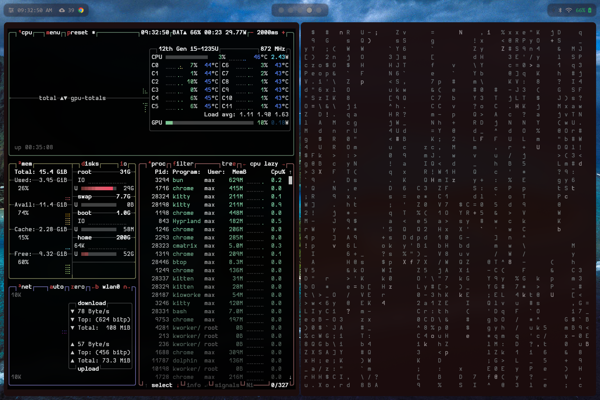
  <br>
  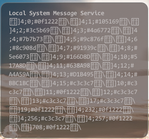
</p>

## dependencies

### core

| package       | purpose                       |
| ------------- | ----------------------------- |
| `hyprland`    | window manager                |
| `waybar`      | status bar                    |
| `kitty`       | terminal emulator             |
| `neovim`      | text editor                   |
| `dunst`       | notification daemon           |
| `wofi`        | app launcher                  |
| `wlogout`     | logout screen                 |
| `pyprland`    | hyprland scratchpads & layout |
| `hyprlock`    | lockscreen                    |
| `hypridle`    | idle management               |
| `swaync`      | notification center           |
| `swayosd-git` | on-screen display overlays    |
| `hyprshot`    | screenshot utility            |
| `swappy`      | screenshot annotation editor  |

### shell & tools

| package        | purpose                                 |
| -------------- | --------------------------------------- |
| `starship`     | prompt                                  |
| `zoxide`       | smart cd                                |
| `fzf`          | fuzzy finder                            |
| `fastfetch`    | system info on terminal start           |
| `bottom`       | system monitor (top/htop replacement)   |
| `htop`         | process viewer                          |
| `cava`         | audio visualizer                        |
| `fuzzel`       | lightweight launcher                    |
| `thunar`       | file manager                            |
| `waypaper`     | wallpaper manager (gui)                 |
| `wtype`        | wayland keyboard input (used by drip)   |
| `python`       | wallpaper-gui.py dependency             |
| `wl-clipboard` | clipboard utils (used by drip)          |
| `imagemagick`  | thumbnail generation (wallpaper-gui)    |
| `awww`         | wallpaper setter (used by cycle script) |

### fonts

| font                           | usage            |
| ------------------------------ | ---------------- |
| `CodeNewRoman Nerd Font Propo` | lockscreen       |
| `Hurmit Nerd Font Mono`        | terminal (kitty) |
| `Bibata-Modern-Ice`            | cursor theme     |

### nvim plugins

alpha, autopair, cmdline, colorscheme, completions, copilot, copilot-chat, css-colors, git, icons, lsp (mason), lualine, markdown, neo-tree, snacks, tab, telescope, treesitter, typr, which-key

## themes

### waybar (4 themes)

| theme            | description                                                           |
| ---------------- | --------------------------------------------------------------------- |
| **default**      | clean, minimal — workspaces, clock, tray, network, battery, bluetooth |
| **experimental** | alternative layout & styling                                          |
| **line**         | thin line separator style                                             |
| **zen**          | ultra-minimal, low distraction                                        |

### colors

colors are generated from wallpaper via **pywal** and sourced throughout the config:

- `colors-hyprland` sourced in hyprland.conf, hyprlock.conf, hypridle.conf
- gtk-3.0 and gtk-4.0 use matching css variable overrides

## wallpapers

48 wallpapers included in `wallpapers/cycle/`. After cloning, symlink so the scripts can find them:

```bash
ln -sf ~/maxdots/wallpapers ~/wallpapers
```

| keybind        | action                      |
| -------------- | --------------------------- |
| `Super+\``     | cycle to a random wallpaper |
| `Super+Alt+\`` | open wallpaper picker GUI   |

The picker shows thumbnails of all wallpapers — click one to set it. On any change, `wal-post.sh` generates a pywal colorscheme and updates kitty, cava, swaync, and gtk themes to match.

### gallery

|                                                          |                                                    |                                                        |
| -------------------------------------------------------- | -------------------------------------------------- | ------------------------------------------------------ |
|        |      |          |
|            |      | 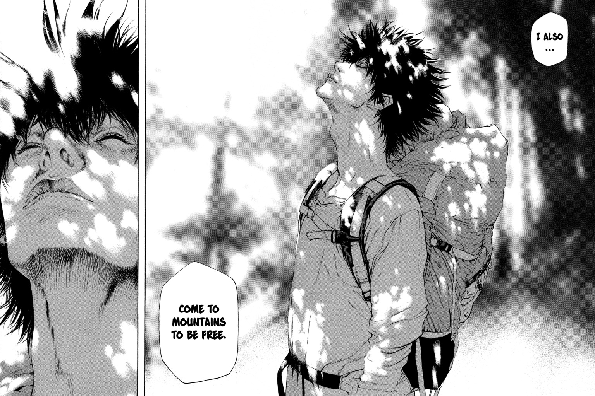         |
| 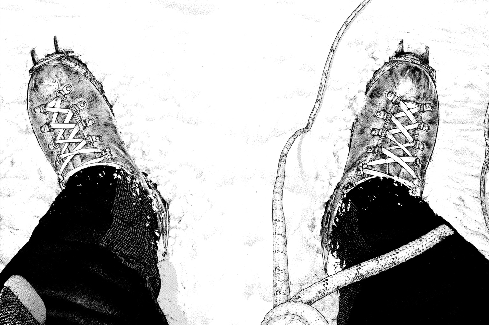           |      | 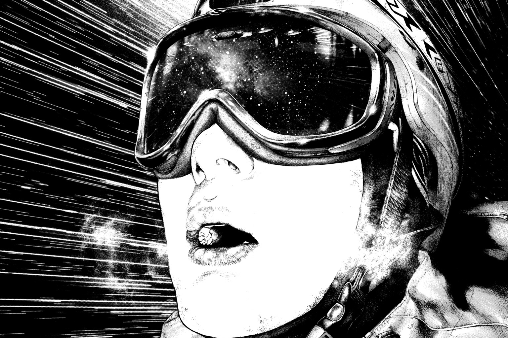         |
| 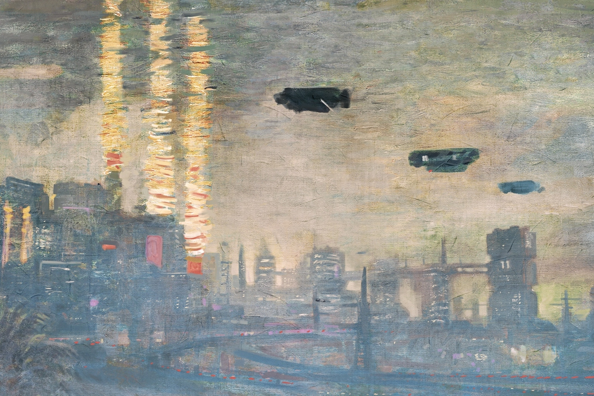       |  |        |
| 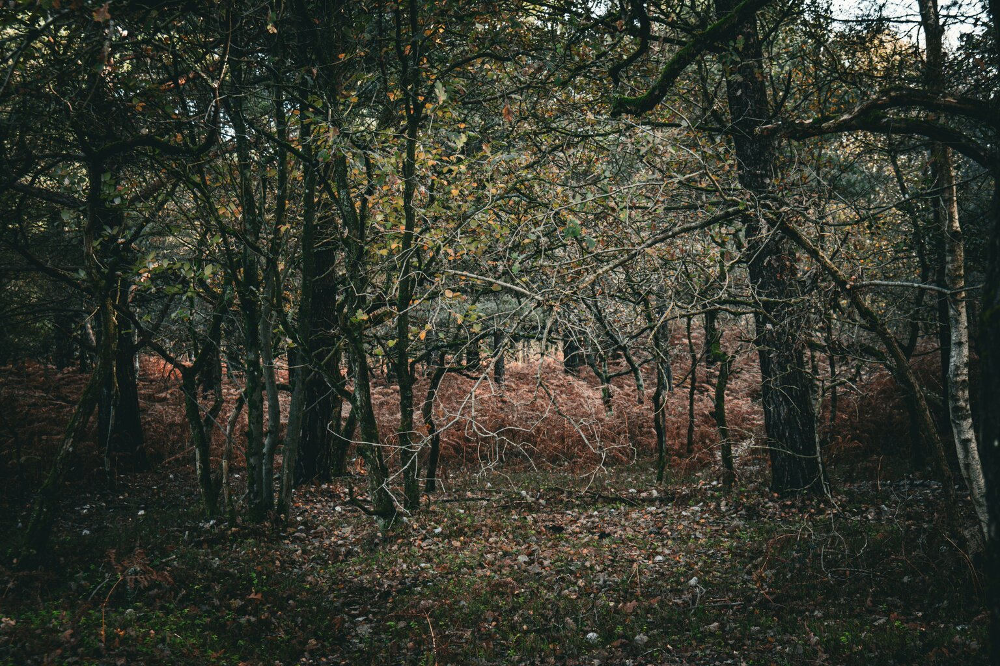       | 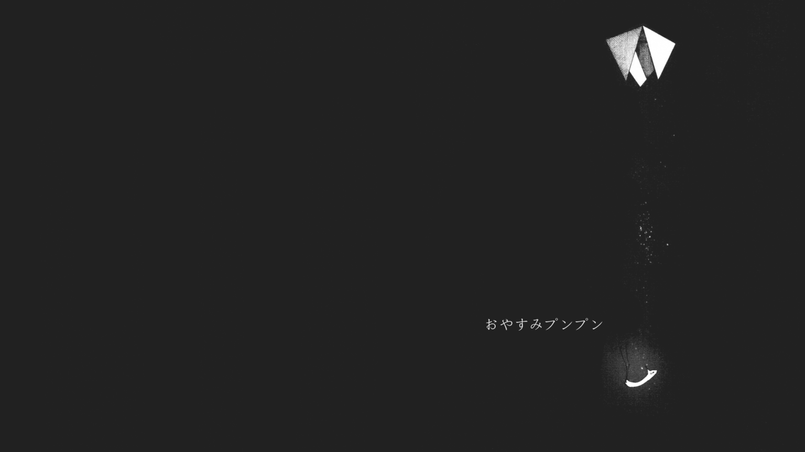             | 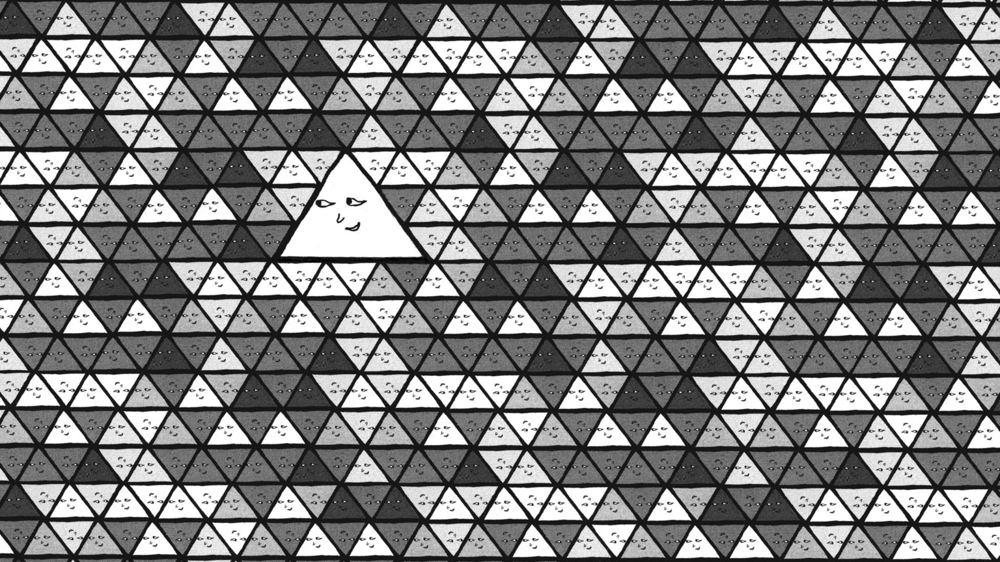 |
| 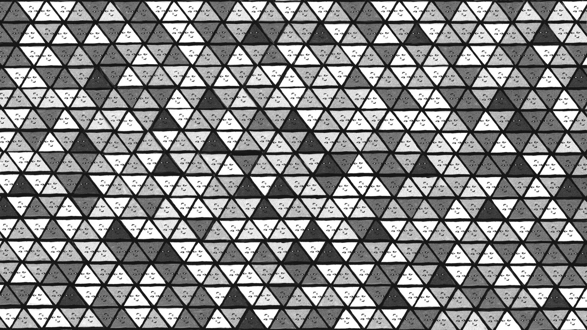 | 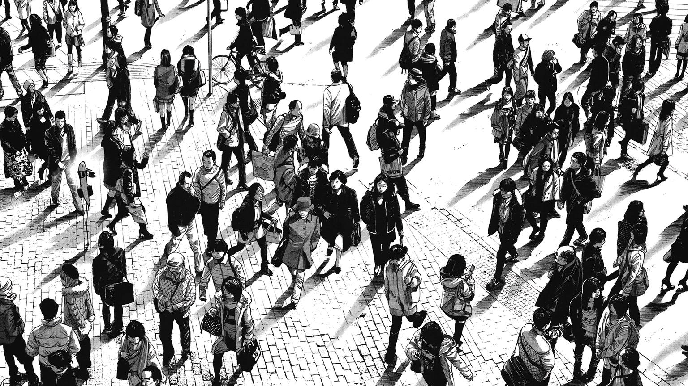 |                                                        |

## installation

```bash
git clone https://github.com/Maxye4655/maxdots.git ~/maxdots
```

### option 1 — stow (recommended)

```bash
sudo pacman -S stow
stow -t ~ -d ~/maxdots .
ln -sf ~/maxdots/wallpapers ~/wallpapers
```

### option 2 — manual symlinks

```bash
for f in .bashrc .bash_profile .gitconfig .gtkrc-2.0; do
  ln -sf ~/maxdots/$f ~/$f
done

for d in .config/*/; do
  ln -sf ~/maxdots/$d ~/$d
done

ln -sf ~/maxdots/.local/bin/drip ~/.local/bin/drip
ln -sf ~/maxdots/wallpapers ~/wallpapers
```

### option 3 — copy (no symlinks)

```bash
cp -a ~/maxdots/.bashrc ~/maxdots/.bash_profile ~/maxdots/.gitconfig ~/
cp -a ~/maxdots/.config/* ~/.config/
cp -a ~/maxdots/.local/bin/* ~/.local/bin/
cp -a ~/maxdots/wallpapers ~/wallpapers
```

## contents

| path                       | what                                                    |
| -------------------------- | ------------------------------------------------------- |
| `.bashrc`, `.bash_profile` | shell setup — starship, zoxide, fzf, fastfetch          |
| `.gitconfig`               | git identity & gh credential helper                     |
| `.config/hypr/`            | hyprland wm config, keybinds, window rules, scripts     |
| `.config/waybar/`          | status bar with 4 themes, custom scripts                |
| `.config/kitty/`           | terminal emulator with everforest theme                 |
| `.config/nvim/`            | neovim — lazy.nvim, lsp, treesitter, telescope, copilot |
| `.config/dunst/`           | notification daemon config                              |
| `.config/wofi/`            | app launcher with custom css                            |
| `.config/wlogout/`         | logout screen with custom icons                         |
| `.config/swaync/`          | notification center with control center                 |
| `.config/pypr/`            | hyprland scratchpads (terminal, pulsemixer)             |
| `.config/fuzzel/`          | lightweight launcher fallback                           |
| `.config/cava/`            | audio visualizer with shaders & themes                  |
| `.config/bottom/`          | system monitor config                                   |
| `.config/htop/`            | process viewer config                                   |
| `.config/gtk-3.0/`         | gtk3 theme overrides (window decorations, thunar)       |
| `.config/gtk-4.0/`         | gtk4 theme overrides                                    |
| `.config/clock-rs/`        | lockscreen clock config                                 |
| `.config/xsettingsd/`      | gtk settings daemon                                     |
| `.config/nwg-look/`        | gtk appearance settings                                 |
| `.config/waypaper/`        | wallpaper manager settings                              |
| `.local/bin/drip`          | realistic text typer script                             |
| `.local/bin/swappy`        | screenshot annotation editor                            |
| `wallpapers/cycle/`        | 48 wallpapers with pywal color generation               |

## known issues

- **kitty.conf.bak** — stale backup, can be removed
- **nvim/nvim/** — nested nvim config directory (artifact); actual config is at `.config/nvim/`
- **cava subdirs** — `cava/cava/`, `wlogout/wlogout/`, `pypr/pypr/`, `swaync/swaync/`, `clock-rs/clock-rs/` are duplicate configs from template installs; the root-level configs take precedence

## credits

- [hyprland](https://hyprland.org/) — wm
- [pywal](https://github.com/dylanaraps/pywal) — color generation
- [lazy.nvim](https://github.com/folke/lazy.nvim) — plugin manager
- [everforest](https://github.com/sainnhe/everforest) — kitty theme
- [waybar-themes](https://github.com/notwidow/hyprland-dots) — waybar theme inspiration

## license

mit
